# 煤矿运输管理系统

基于Django的煤矿运输管理系统。记录每次煤矿运输过程中的司机、货物、付款信息，并使用二维码进行跟踪。

## 截图

### 进货

煤矿新建出货记录

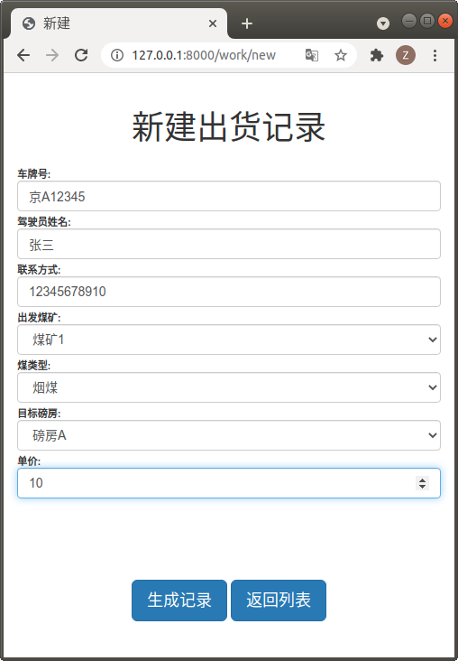

生成出货单

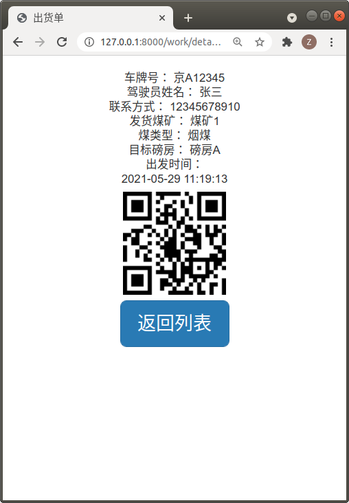

到达磅房后扫码

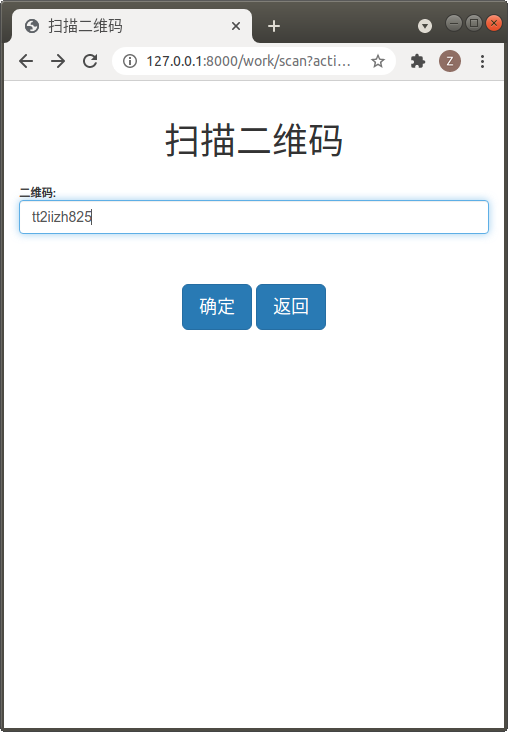

填写称重结果

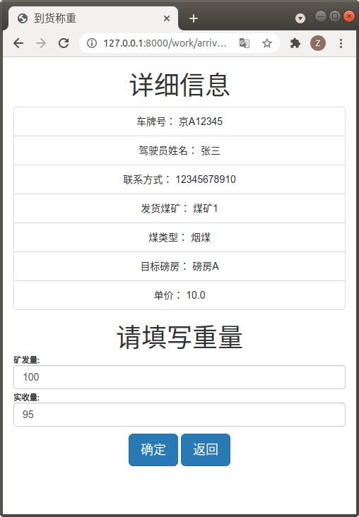

再次扫码并选择油卡

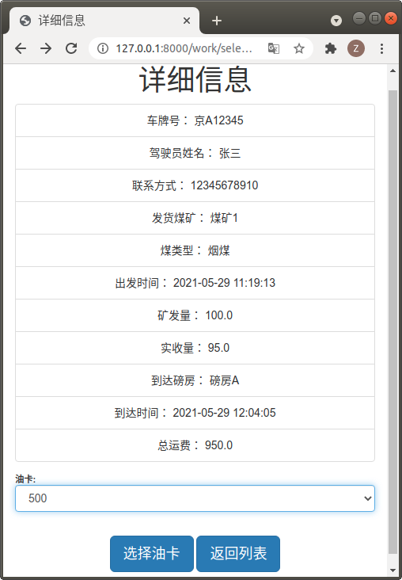

选择付款方式

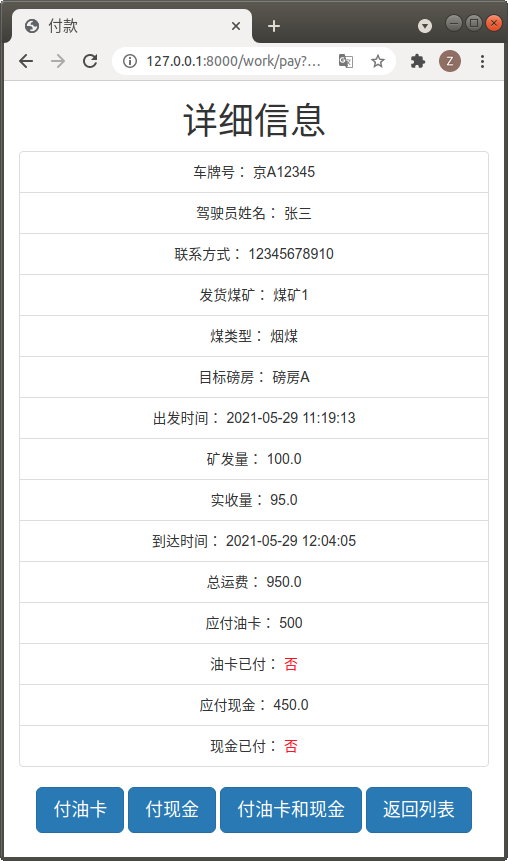

操作完成

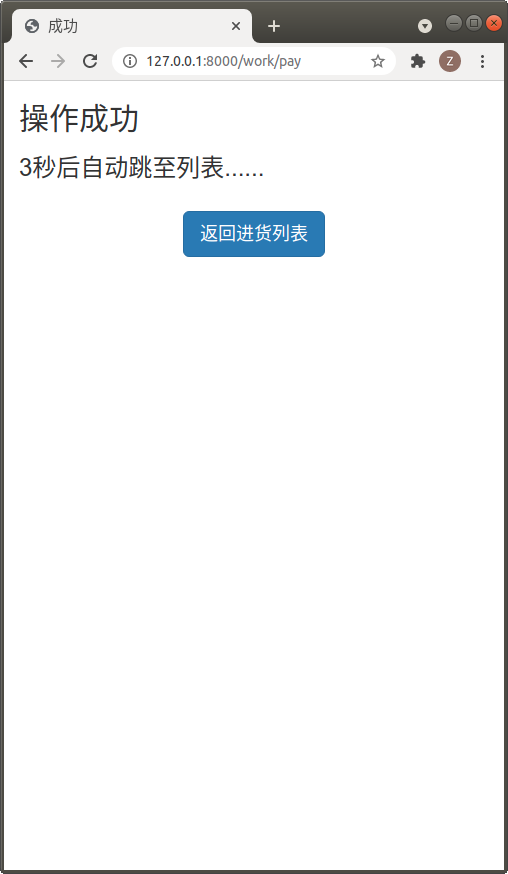

进货记录列表

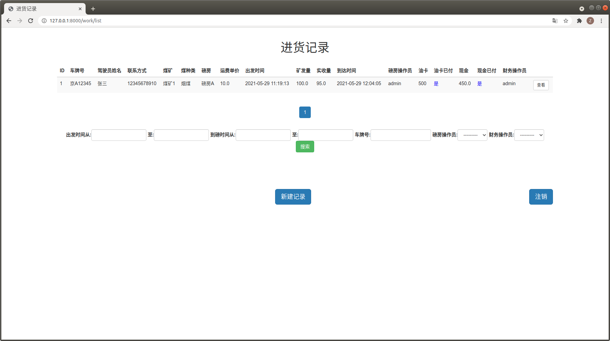

### 出货

磅房新建出货记录

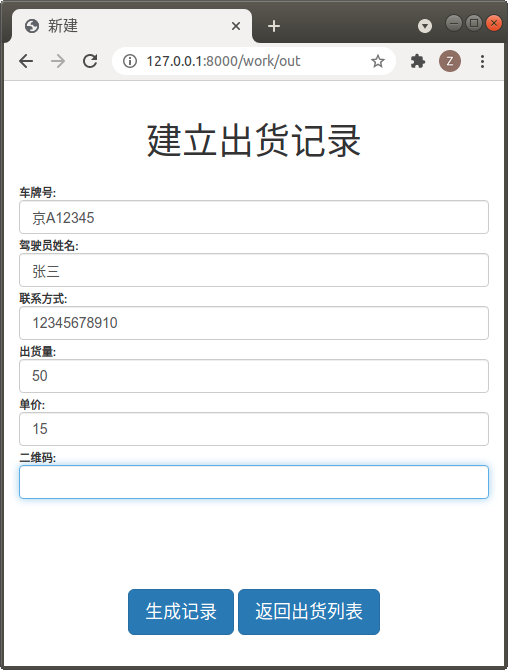

生成出货单

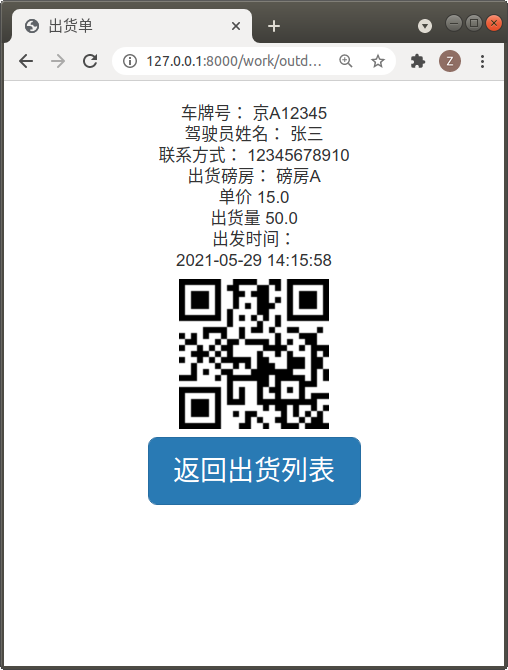

到货后扫码并付款

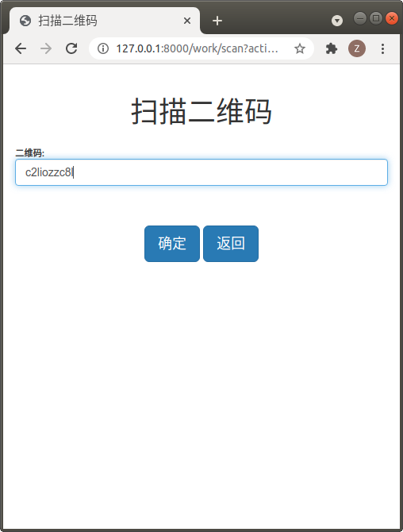

出货记录列表

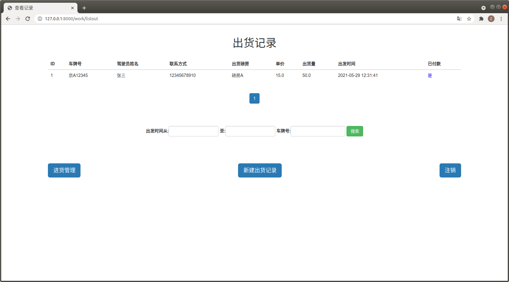

### 统计信息

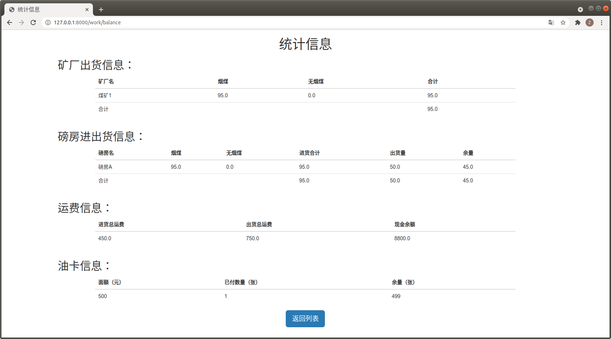